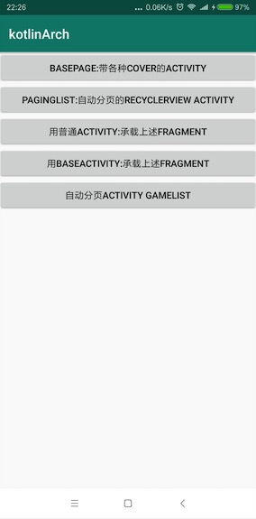

# kotlinArch[](https://jitpack.io/#manondidi/kotlinArch)
kotlin开发脚手架

开发模板,可以一键生成mvp类,并自动写好相应通用代码 :https://github.com/manondidi/kotlinArchTemplate


### 混淆请参考demo工程的配法

安装

```

allprojects {
    repositories {
        maven { url "https://jitpack.io" }
    }
}

```
```

implementation 'com.github.manondidi:kotlinArch:latest-version'
```


##Todo
- [x] rxkotlin

- [x] rxbus

- [x] 页面destory rx自动取消

- [x] mvp

- [ ] ~~databinding或viewmodel~~(业务层自己实现)

- [x] 策略模式的自动分页

- [x] 各种cover封装

- [x] 列表数据的解耦 itembinder

- [x] mock管理

- [x] 开发模板(自动生成代码)

- [x] 详细案例


  ......





